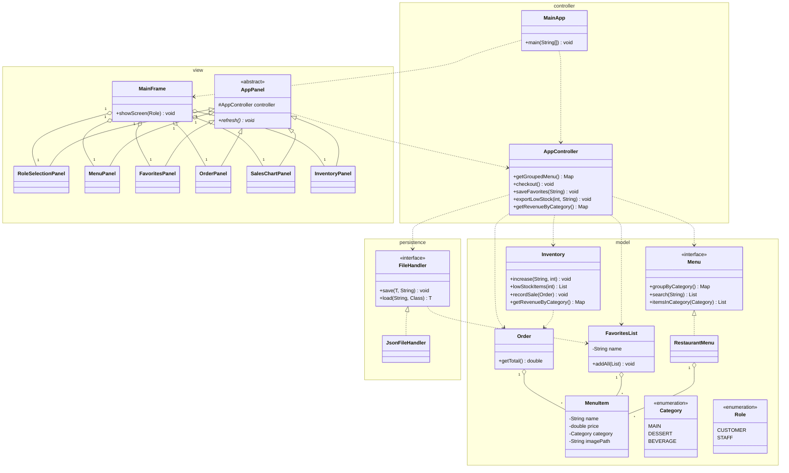

# Design draft, structure and interfaces (v13)

This draft covers the package layout, the public Model API, and the persistence
layer. This version drops the `Report` class. The staff export is now just the
low stock sub-list, and the sales totals are display only in `SalesChartPanel`.
Favorites are display, save, load, and modify only; they do not feed the cart
or checkout. No method bodies.

Base package is a placeholder named `menuapp`. Pick the real one before we lock
this, and set `mainClass = menuapp.MainApp` in `build.gradle`.

## Package structure

```
menuapp
├── MainApp.java                       (E) entry point, wires the layers
├── model                              (A + B, shared)
│   ├── MenuItem.java                  one item class, no subclasses
│   ├── Category.java                  enum, MAIN DESSERT BEVERAGE
│   ├── Role.java                      enum, CUSTOMER or STAFF
│   ├── Menu.java                      interface, the catalog contract
│   ├── RestaurantMenu.java            implements Menu
│   ├── FavoritesList.java             the customer savable list
│   ├── Order.java                     the current cart, items with quantities
│   └── Inventory.java                 stock plus the sales totals
├── persistence                        (C)
│   ├── FileHandler.java               interface
│   └── JsonFileHandler.java           implements FileHandler with Jackson
├── controller                         (E)
│   └── AppController.java             the single controller the view talks to
└── view                               (D)
    ├── AppPanel.java                  abstract base for every screen
    ├── MainFrame.java                 holds a CardLayout, switches screens
    ├── RoleSelectionPanel.java        first screen, pick customer or staff
    ├── MenuPanel.java                 customer, browse and filter by category, search
    ├── FavoritesPanel.java            customer, build, save, load, modify
    ├── OrderPanel.java                customer, cart, quantities, total
    ├── SalesChartPanel.java           staff, revenue by category bar chart
    └── InventoryPanel.java            staff, stock, restock, low stock export
```

## Design decisions and why

One menu item class, no subclasses. Food and Drink would differ only in data,
not in behaviour, so a single `MenuItem` with a `Category` enum is cleaner than
a hierarchy. Creating subclasses with no behavioural difference is the thing
good design avoids.

Polymorphism lives in the interfaces. `Menu` and `FileHandler` each have an
implementation, and the view depends on the interfaces. That is where dynamic
dispatch shows up, along with the `AppPanel` hierarchy. These are also the seams
that let the team work in parallel with stubs.

Single class simplifies JSON. Because `MenuItem` has no subclasses, saved lists
round trip through Jackson with no polymorphic type handling.

Failures use an unchecked exception. Saving and loading can fail. To keep the
signatures clean, `JsonFileHandler` catches the low level `IOException` and
rethrows it as an unchecked `RuntimeException` that carries the original cause,
so `IOException` still does not leak above persistence. Nothing declares a
`throws` clause. The tradeoff is that the compiler no longer forces the view to
handle it, so the panels that save or load should still wrap the call in a try
and catch it to show a `JOptionPane`, but that is now a convention, not a
compiler check.

Stock lives in Inventory, not in MenuItem. A `MenuItem` holds fixed catalog
data. Stock changes over time, so it lives in `Inventory`, keyed by item name.
Because `Inventory` is keyed by name, its keys must match the `Menu` item names
exactly. `MainApp` seeds both from the same source so they line up, and item
names never change once seeded.

Restock is a staff GUI action, not a file. Staff adjust stock in the inventory
panel through `Inventory.increase` and `Inventory.setStock`.

Filter and build sub-list are separate mechanisms. The optional filter feature
is the customer category filter, `Menu.itemsInCategory` shown live in
`MenuPanel`. The required build sub-list feature is the staff low stock list,
`Inventory.lowStockItems` at a chosen threshold, exported to JSON. Filter
narrows the display, build sub-list produces a saved file.

Panels share a base class. `AppPanel extends JPanel` holds the controller and
declares an abstract `refresh`. Every screen extends it and overrides `refresh`.
`MainFrame` switches screens through an `AppPanel` reference, so the right
`refresh` runs by dynamic dispatch. This is the class inheritance and overriding
the rubric looks for, on top of the two interfaces.

Numeric data in a graph. The staff screen shows a `SalesChartPanel` with a bar
chart of revenue by category. `Inventory` accumulates revenue per `Category` at
checkout and exposes it, and the panel draws it with JFreeChart. This replaces
the earlier online API feature, and it reuses numbers the model already tracks.

The checkout flow ties the pieces together. When a customer confirms an order,
`AppController` decreases `Inventory` by each item quantity and calls
`Inventory.recordSale`, which raises the order count and adds the order total to
revenue, then clears the cart.

One controller, not a facade. `AppController` is the single control hub. It
holds the model and persistence objects and exposes every action the view needs.
For this size one cohesive controller is simpler than several, and the view
depends on one class. The MVC split, the two interfaces, and the `AppPanel`
hierarchy carry the design story. `Inventory` now also keeps the running sales
totals, including revenue per category, since the checkout that touches stock is
the same moment a sale is recorded.

Role based screens. The GUI opens on a role selection screen. Customer switches
to the menu, favorites, and cart panels. Staff switches to the inventory and
sales chart panels. Role only decides which screen shows, so there is no login.

## Feature coverage

Required
```
Swing GUI                 -> the view layer, MainFrame and the panels
View all by category       -> Menu.groupByCategory shown in MenuPanel
Build sub-list by criteria -> staff low stock list at a chosen threshold
Save list to JSON         -> FileHandler exports the low stock sub-list
```

Additional
```
Load and modify a list -> FileHandler loads a FavoritesList, edit, save again
Search                  -> Menu.search by item name
Filter                  -> Menu.itemsInCategory, customer filters the menu to one category
Numeric data in a graph -> Inventory.getRevenueByCategory shown as a bar chart in SalesChartPanel
Images                  -> MenuItem imagePath shown in the panels
```

Sort is not one of the five. `Menu.sortedBy` stays as a small bonus.

## Feature to file operation map

```
save FavoritesList     -> optional, save the customer favorites to JSON
load FavoritesList      -> optional, load a saved favorites list to modify it
save low stock list    -> required, export the low stock sub-list to JSON
```

The menu is seeded in code and never read from a file. The cart and the sales
totals stay in memory and are not saved.

## Model API

### Category and Role

```java
package menuapp.model;

/** Display grouping used when the menu is shown by section. */
public enum Category { MAIN, DESSERT, BEVERAGE }
```

```java
package menuapp.model;

/** Which screen a user enters. Only decides the view, no account behind it. */
public enum Role { CUSTOMER, STAFF }
```

### MenuItem

```java
package menuapp.model;

/** One item on the menu. A single class, distinguished only by its category. */
public class MenuItem {

    private final String name;
    private final double price;
    private final Category category;
    private final String imagePath;

    /**
     * Creates a menu item.
     *
     * @param name unique display name, used as the identity of the item
     * @param price price in dollars, must not be negative
     * @param category the section this item is grouped under
     * @param imagePath path to the item image, or null when there is none
     */
    public MenuItem(String name, double price, Category category,
                    String imagePath) { }

    /** @return the unique display name of this item */
    public String getName() { }

    /** @return the price in dollars */
    public double getPrice() { }

    /** @return the section this item is grouped under */
    public Category getCategory() { }

    /** @return the image path, or null when there is none */
    public String getImagePath() { }

    /**
     * Two items are equal when their names match.
     *
     * @param other the object to compare with
     * @return true when both are menu items with the same name
     */
    @Override
    public boolean equals(Object other) { }

    /** @return a hash based on the name, consistent with equals */
    @Override
    public int hashCode() { }
}
```

### Menu (interface) and RestaurantMenu

```java
package menuapp.model;

import java.util.Comparator;
import java.util.List;
import java.util.Map;

/**
 * The catalog of menu items. This is the seam the other layers depend on.
 * Every method that returns a list or map returns a fresh copy. The caller may
 * sort or edit it freely without touching the catalog.
 */
public interface Menu {

    /**
     * Adds an item to the catalog.
     *
     * @param item the item to add
     */
    void addItem(MenuItem item);

    /**
     * Removes the item with the given name.
     *
     * @param name the unique name of the item to remove
     * @return true when an item was removed
     */
    boolean removeItem(String name);

    /** @return a new list of every item in insertion order */
    List<MenuItem> getAllItems();

    /**
     * Groups every item by its category for the sectioned view.
     * This backs the required organized view feature.
     *
     * @return a new map from category to a new list of items in that category
     */
    Map<Category, List<MenuItem>> groupByCategory();

    /**
     * Returns every item in a chosen order. A small bonus, not one of the five.
     *
     * @param order the comparator that defines the order
     * @return a new sorted list
     */
    List<MenuItem> sortedBy(Comparator<MenuItem> order);

    /**
     * Finds items whose name contains the keyword. Backs the search feature.
     *
     * @param keyword the text to look for
     * @return a new list of the matching items
     */
    List<MenuItem> search(String keyword);

    /**
     * Returns the items in one category, used to build a favorites sub-list.
     *
     * @param category the category to collect
     * @return a new list of the items in that category
     */
    List<MenuItem> itemsInCategory(Category category);

    /** @return the number of items in the catalog */
    int size();
}
```

`RestaurantMenu implements Menu` holds the items and provides the bodies.

### FavoritesList

```java
package menuapp.model;

import java.util.List;

/**
 * A named list of items a customer views, edits, saves, and loads. It is not
 * part of the ordering path; checkout always goes through the cart. Saving and
 * loading this list backs the optional load and modify feature.
 */
public class FavoritesList {

    private String name;

    /**
     * Creates an empty favorites list with a label.
     *
     * @param name the label shown for this list, also the file base name
     */
    public FavoritesList(String name) { }

    /**
     * Adds one item to the list.
     *
     * @param item the item to add
     */
    public void add(MenuItem item) { }

    /**
     * Adds every item in a batch, for example a whole category.
     *
     * @param items the items to add
     */
    public void addAll(List<MenuItem> items) { }

    /**
     * Removes an item from the list.
     *
     * @param name the name of the item to remove
     * @return true when the item was present
     */
    public boolean remove(String name) { }

    /**
     * Tests whether an item is in the list.
     *
     * @param name the name of the item
     * @return true when the item is present
     */
    public boolean contains(String name) { }

    /** @return the items in the list */
    public List<MenuItem> getItems() { }

    /** @return the number of items */
    public int size() { }

    /** @return the label of this list */
    public String getName() { }

    /**
     * Renames the list.
     *
     * @param name the new label
     */
    public void setName(String name) { }
}
```

### Order (the cart)

```java
package menuapp.model;

import java.util.List;
import java.util.Map;

/**
 * The current cart. Holds items with quantities and computes the total.
 * Shown in the order panel and recorded in sales at checkout.
 */
public class Order {

    /**
     * Adds one unit of an item, or raises its quantity by one.
     *
     * @param item the item to add
     */
    public void add(MenuItem item) { }

    /**
     * Adds a given quantity of an item.
     *
     * @param item the item to add
     * @param quantity how many units, must be positive
     */
    public void add(MenuItem item, int quantity) { }

    /**
     * Sets the quantity of an item already in the cart.
     *
     * @param name the name of the item
     * @param quantity the new quantity, must be positive
     */
    public void setQuantity(String name, int quantity) { }

    /**
     * Removes an item from the cart.
     *
     * @param name the name of the item to remove
     * @return true when the item was present
     */
    public boolean remove(String name) { }

    /** @return the distinct items in the cart */
    public List<MenuItem> getItems() { }

    /** @return each item paired with its quantity */
    public Map<MenuItem, Integer> getItemsWithQuantities() { }

    /** @return the total price across all items and quantities */
    public double getTotal() { }

    /** @return the number of distinct items */
    public int size() { }

    /** Empties the cart. */
    public void clear() { }
}
```

### Inventory (staff facing)

```java
package menuapp.model;

import java.util.List;
import java.util.Map;

/**
 * Tracks how many units of each item are in stock, and the running sales
 * totals. Used by the staff screen. Keyed by item name, so every key must match
 * a `Menu` item name exactly.
 */
public class Inventory {

    /**
     * Sets the stock level of an item.
     *
     * @param itemName the name of the item
     * @param quantity the stock level, must not be negative
     */
    public void setStock(String itemName, int quantity) { }

    /**
     * Reads the stock level of an item.
     *
     * @param itemName the name of the item
     * @return the current stock, or zero when unknown
     */
    public int getStock(String itemName) { }

    /**
     * Tests whether an item has any stock.
     *
     * @param itemName the name of the item
     * @return true when stock is above zero
     */
    public boolean isInStock(String itemName) { }

    /**
     * Increases the stock of an item, used when staff restock.
     *
     * @param itemName the name of the item
     * @param amount how many units to add, must be positive
     */
    public void increase(String itemName, int amount) { }

    /**
     * Reduces the stock of an item, used when an order is placed.
     *
     * @param itemName the name of the item
     * @param amount how many units to remove, must be positive
     */
    public void decrease(String itemName, int amount) { }

    /**
     * Lists items at or below a stock threshold, the ones needing restock.
     * This backs the optional filter feature on the staff screen.
     *
     * @param threshold the level to compare against
     * @return the names of low stock items
     */
    public List<String> lowStockItems(int threshold) { }

    /** @return a snapshot of every item name and its stock, for the inventory table */
    public Map<String, Integer> getAllStock() { }

    /**
     * Records one placed order. Raises the order count, adds the order total to
     * revenue, and adds each item line to the revenue for its category. Called
     * by the controller at checkout.
     *
     * @param order the order that was placed
     */
    public void recordSale(Order order) { }

    /** @return how many orders have been placed */
    public int getOrderCount() { }

    /** @return the total revenue across all placed orders */
    public double getTotalRevenue() { }

    /**
     * Returns revenue split by category, the data behind the sales chart.
     *
     * @return a new map from category to its accumulated revenue
     */
    public Map<Category, Double> getRevenueByCategory() { }
}
```

## Persistence API

The interface keeps clean signatures with no `throws` clause. `JsonFileHandler`
catches the `IOException` from Jackson and rethrows it as an unchecked
`RuntimeException` carrying the cause, so `java.io.IOException` never leaks above
persistence.

```java
package menuapp.persistence;

/**
 * Reads and writes model objects to disk. This is the persistence seam,
 * so it can be mocked in tests. One generic pair serves the favorites list
 * and the low stock list.
 */
public interface FileHandler {

    /**
     * Writes any model object to a file.
     *
     * @param data the object to save, for example a FavoritesList or the low stock list
     * @param filePath where to write it
     * @param <T> the type of the object
     */
    <T> void save(T data, String filePath);

    /**
     * Reads a model object back from a file.
     *
     * @param filePath the file to read
     * @param type the class to load into
     * @param <T> the type of the object
     * @return the loaded object
     */
    <T> T load(String filePath, Class<T> type);
}
```

`JsonFileHandler implements FileHandler` wraps a Jackson `ObjectMapper`. It
catches the `IOException` and rethrows it as an unchecked `RuntimeException`
with the failure as the cause, so a caller that wants to react can still catch
it.

## Controller

`AppController` is the single control hub the view calls. It holds the model and
persistence objects, plus the current cart and favorites.

```java
package menuapp.controller;

import java.util.List;
import java.util.Map;
import menuapp.model.*;
import menuapp.persistence.FileHandler;

/**
 * The single controller the view calls. It holds the catalog, inventory, and
 * persistence, plus the current cart and favorites, and exposes every action
 * the panels need.
 */
public class AppController {

    private final Menu menu;
    private final Inventory inventory;
    private final FileHandler fileHandler;
    private final Order cart;
    private FavoritesList favorites;

    /**
     * Wires the controller to the shared collaborators.
     *
     * @param menu the catalog
     * @param inventory the stock and the sales totals
     * @param fileHandler saves and loads files
     */
    public AppController(Menu menu, Inventory inventory,
                         FileHandler fileHandler) { }

    /** @return every item grouped by category, for the menu view */
    public Map<Category, List<MenuItem>> getGroupedMenu() { }

    /**
     * Searches the menu by keyword.
     *
     * @param keyword the text to look for
     * @return the matching items
     */
    public List<MenuItem> search(String keyword) { }

    /**
     * Adds an item to the cart.
     *
     * @param item the item to add
     */
    public void addToCart(MenuItem item) { }

    /**
     * Removes an item from the cart.
     *
     * @param name the name of the item to remove
     */
    public void removeFromCart(String name) { }

    /**
     * Sets the quantity of a cart item.
     *
     * @param name the name of the item
     * @param quantity the new quantity
     */
    public void setCartQuantity(String name, int quantity) { }

    /** @return the current cart */
    public Order getCart() { }

    /**
     * Confirms the cart. Decreases inventory by each quantity, records the
     * sale, then clears the cart.
     */
    public void checkout() { }

    /**
     * Adds an item to the favorites list.
     *
     * @param item the item to add
     */
    public void addToFavorites(MenuItem item) { }

    /**
     * Filters the menu down to one category, for the live display.
     * This backs the optional filter feature.
     *
     * @param category the category to show
     * @return the items in that category
     */
    public List<MenuItem> filterByCategory(Category category) { }

    /** @return the current favorites list */
    public FavoritesList getFavorites() { }

    /**
     * Saves the favorites list to a file.
     *
     * @param filePath where to write it
     */
    public void saveFavorites(String filePath) { }

    /**
     * Loads a favorites list from a file so it can be modified.
     *
     * @param filePath the file to read
     */
    public void loadFavorites(String filePath) { }

    /**
     * Restocks an item from the staff screen.
     *
     * @param itemName the item to restock
     * @param amount how many units to add
     */
    public void restock(String itemName, int amount) { }

    /** @return the inventory, for the staff view */
    public Inventory getInventory() { }

    /**
     * Builds the low stock sub-list at a chosen threshold. This is the
     * required build sub-list feature, with the threshold as the criterion.
     *
     * @param threshold the level to compare against
     * @return the names of low stock items
     */
    public List<String> getLowStockItems(int threshold) { }

    /**
     * Exports the low stock sub-list to a JSON file. This is the required
     * build sub-list plus save feature.
     *
     * @param threshold the low stock threshold
     * @param filePath where to write it
     */
    public void exportLowStock(int threshold, String filePath) { }

    /**
     * Returns revenue by category, the data the sales chart draws.
     *
     * @return a map from category to its accumulated revenue
     */
    public Map<Category, Double> getRevenueByCategory() { }
}
```

```java
package menuapp;

/**
 * Entry point. Builds the model, the single AppController, and the GUI, then
 * shows the window. It injects the shared Menu, Inventory, and FileHandler into
 * the controller.
 */
public class MainApp {

    /**
     * Starts the application.
     *
     * @param args unused
     */
    public static void main(String[] args) { }
}
```

## View

`AppPanel` is an abstract base class shared by every screen. It holds the
`AppController` and declares an abstract `refresh`. Each screen extends it and
overrides `refresh`. `MainFrame` extends `JFrame` and swaps panels with a
`CardLayout`.

```java
package menuapp.view;

import javax.swing.JPanel;
import menuapp.controller.AppController;

/** Shared base for every screen. Holds the controller and the redraw contract. */
public abstract class AppPanel extends JPanel {

    /** The controller every panel talks to. */
    protected final AppController controller;

    /**
     * Stores the controller for the subclass to use.
     *
     * @param controller the shared controller
     */
    protected AppPanel(AppController controller) {
        this.controller = controller;
    }

    /** Redraws this panel from the current model state. */
    public abstract void refresh();
}
```

Each concrete panel extends `AppPanel` and overrides `refresh`.

```
MainFrame(AppController)           extends JFrame, switches screens by Role
RoleSelectionPanel(AppController)  pick customer or staff
MenuPanel(AppController)           browse by category, filter by category, search, add to cart or favorites
FavoritesPanel(AppController)      view, build, save, load, modify; no path into the cart
OrderPanel(AppController)          cart items, quantities, total, checkout
SalesChartPanel(AppController)     staff, revenue by category bar chart plus order count and total revenue
InventoryPanel(AppController)      stock table, restock, export low stock list
```

`SalesChartPanel` reads `controller.getRevenueByCategory()`, builds a JFreeChart
bar chart, and shows it in a `ChartPanel`. It also shows the order count and the
total revenue as text. All of this is display only, none of it is exported. Its
`refresh` rebuilds from the current numbers. This adds one Gradle dependency,
`org.jfree:jfreechart:1.5.6`.

`InventoryPanel` shows the stock table, has the restock controls, and exports
the low stock sub-list to JSON. That export is the required save feature.

The panels that trigger a save or load, `FavoritesPanel` and `InventoryPanel`,
wrap the call in a try and catch the unchecked `RuntimeException` from the file
layer, then show the message in a `JOptionPane`. This is a convention now, not a
compiler check, so those panels must remember to do it.

## Class diagram (Mermaid, all layers)

Classes are grouped by package. Data classes show their fields. Polymorphism
lives in the two interfaces and in the AppPanel base class.


