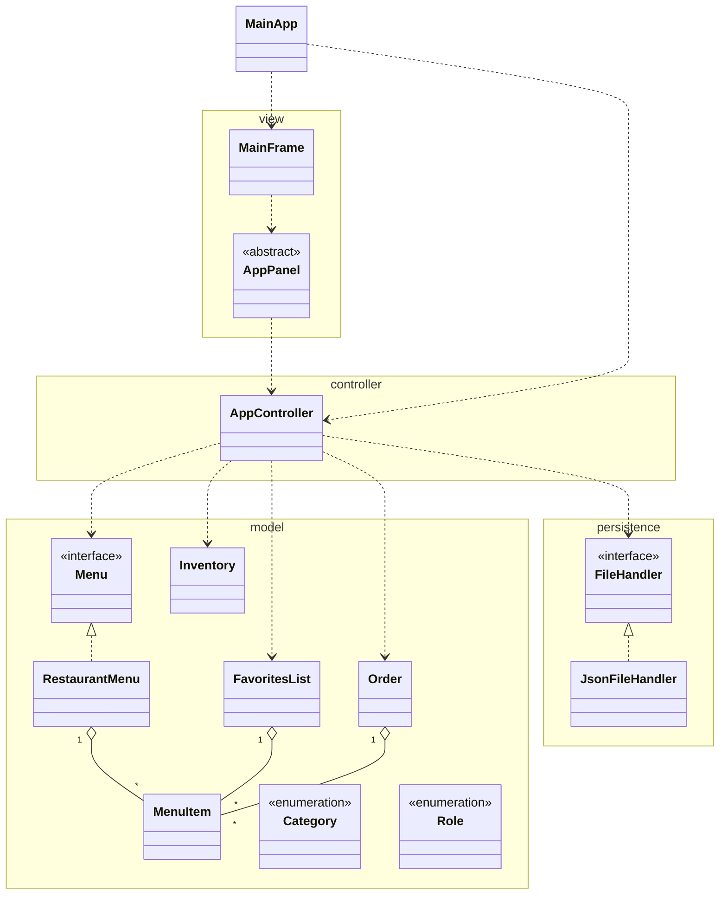
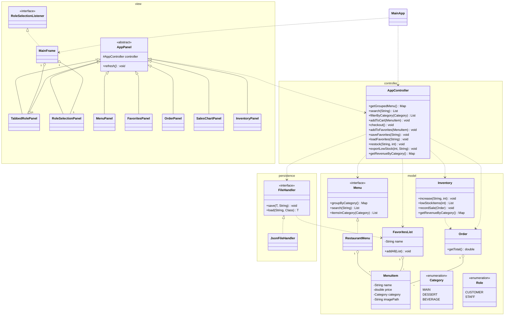

# UML Class Diagrams

NU Cafe Program — CS 5004 Team 7

## Initial design

```mermaid
classDiagram
direction TB

namespace model {
  class MenuItem
  class Menu {
    <<interface>>
  }
  class RestaurantMenu
  class FavoritesList
  class Order
  class Inventory
  class Category {
    <<enumeration>>
  }
  class Role {
    <<enumeration>>
  }
}

namespace persistence {
  class FileHandler {
    <<interface>>
  }
  class JsonFileHandler
}

namespace controller {
  class AppController
}

namespace view {
  class AppPanel {
    <<abstract>>
  }
  class MainFrame
}

class MainApp

Menu <|.. RestaurantMenu
FileHandler <|.. JsonFileHandler
AppController ..> Menu
AppController ..> Order
AppController ..> FavoritesList
AppController ..> Inventory
AppController ..> FileHandler
AppPanel ..> AppController
MainApp ..> AppController
MainApp ..> MainFrame
MainFrame ..> AppPanel
RestaurantMenu "1" o-- "*" MenuItem
FavoritesList "1" o-- "*" MenuItem
Order "1" o-- "*" MenuItem
```

## Final design

```mermaid
classDiagram
namespace view {
  class AppPanel {
    <<abstract>>
    #AppController controller
    +refresh()* void
  }
  class MainFrame
  class TabbedRolePanel
  class RoleSelectionPanel
  class MenuPanel
  class FavoritesPanel
  class OrderPanel
  class SalesChartPanel
  class InventoryPanel
  class RoleSelectionListener {
    <<interface>>
  }
}
namespace controller {
  class AppController {
    +getGroupedMenu() Map
    +search(String) List
    +filterByCategory(Category) List
    +addToCart(MenuItem) void
    +checkout() void
    +addToFavorites(MenuItem) void
    +saveFavorites(String) void
    +loadFavorites(String) void
    +restock(String, int) void
    +exportLowStock(int, String) void
    +getRevenueByCategory() Map
  }
}
namespace persistence {
  class FileHandler {
    <<interface>>
    +save(T, String) void
    +load(String, Class) T
  }
  class JsonFileHandler
}
namespace model {
  class MenuItem {
    -String name
    -double price
    -Category category
    -String imagePath
  }
  class Menu {
    <<interface>>
    +groupByCategory() Map
    +search(String) List
    +itemsInCategory(Category) List
  }
  class RestaurantMenu
  class FavoritesList {
    -String name
    +addAll(List) void
  }
  class Order {
    +getTotal() double
  }
  class Inventory {
    +increase(String, int) void
    +lowStockItems(int) List
    +recordSale(Order) void
    +getRevenueByCategory() Map
  }
  class Category {
    <<enumeration>>
    MAIN
    DESSERT
    BEVERAGE
  }
  class Role {
    <<enumeration>>
    CUSTOMER
    STAFF
  }
}

class MainApp

Menu <|.. RestaurantMenu
FileHandler <|.. JsonFileHandler
AppPanel <|-- TabbedRolePanel
AppPanel <|-- RoleSelectionPanel
AppPanel <|-- MenuPanel
AppPanel <|-- FavoritesPanel
AppPanel <|-- OrderPanel
AppPanel <|-- SalesChartPanel
AppPanel <|-- InventoryPanel
RoleSelectionListener <|.. MainFrame
RestaurantMenu "1" o-- "*" MenuItem
FavoritesList "1" o-- "*" MenuItem
Order "1" o-- "*" MenuItem
Inventory ..> Order
FileHandler ..> FavoritesList
AppController ..> Menu
AppController ..> Order
AppController ..> FavoritesList
AppController ..> Inventory
AppController ..> FileHandler
AppPanel ..> AppController
MainApp ..> AppController
MainApp ..> MainFrame
MainFrame "1" o-- "1" RoleSelectionPanel
MainFrame "1" o-- "2" TabbedRolePanel
TabbedRolePanel "1" o-- "*" AppPanel
```
