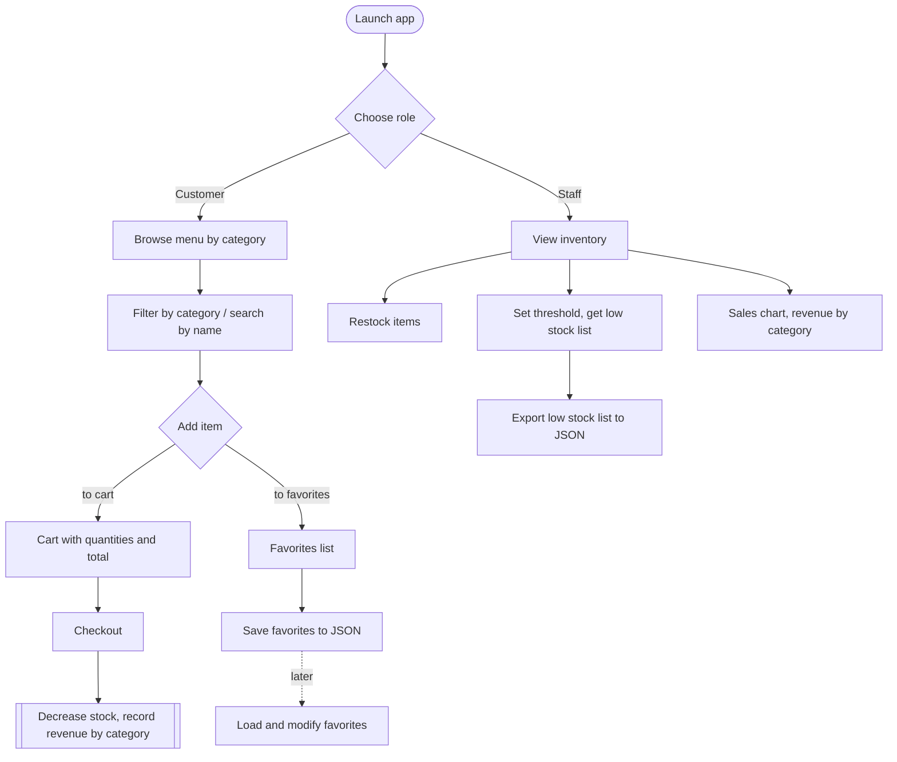
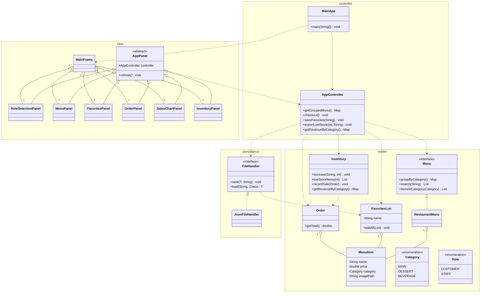

# Restaurant Menu App

A desktop restaurant application built with Java Swing. Customers browse the
menu, filter and search, build a cart, and save favorites. Staff track
inventory, restock, export the low stock list, and view a bar chart of revenue
by category. All data stays in local JSON files. There is no database.

Course, CS 5004, Northeastern University, Summer 2026.

## Team and modules

A and B share the model. Fill in each GitHub handle before submission.

| Member | GitHub  | Module |
|--------|---------|--------|
| Si Tu | TBD     | Model, shared |
| Yixuan Liu | YIXUAN-LIU-lab | Model, shared |
| Jessie | TBD     | Persistence |
| Boco | LuBocNU | View |
| Leijie Tao | leijie-tao | Controller, Integration |

## Architecture

Four packages under `menuapp`. The view depends on the controller. The
controller depends on the model and persistence. Nothing lower depends on the
view. Polymorphism comes from two interfaces, `Menu` and `FileHandler`, and from
the `AppPanel` base class.

```
menuapp
├── model        (A, B)  MenuItem, Menu, RestaurantMenu, FavoritesList, Order,
│                        Inventory, Category, Role
├── persistence  (C)     FileHandler, JsonFileHandler
├── controller   (E)     AppController, MainApp
└── view         (D)     AppPanel, MainFrame, and the screen panels
```

## Feature map

Owners are the initials from the table above. The four required features and the
five additional features are listed with where they live and what to build.

| # | Feature | Type | Where, owner | What to build |
|---|---------|------|--------------|---------------|
| 1 | Swing GUI | Required | `view` package, D | `MainFrame` with a `CardLayout`, `AppPanel` subclasses for each screen, a role selection screen |
| 2 | View all by category | Required | `Menu.groupByCategory` A B, `MenuPanel` D | group all items by category and render one section per category |
| 3 | Build filtered sub-list by criteria | Required | `Inventory.lowStockItems` A B, `InventoryPanel` D | staff sets a stock threshold, app returns the low stock sub-list |
| 4 | Save list to JSON | Required | `FileHandler` and `JsonFileHandler` C, `AppController.exportLowStock` E | export the low stock sub-list to a JSON file |
| 5 | Load and modify a list | Additional | `FileHandler` C, `FavoritesList` A B, `FavoritesPanel` D | view favorites, load a saved file, edit it, save it again; favorites do not enter the cart |
| 6 | Search | Additional | `Menu.search` A B, `MenuPanel` D | find menu items by name |
| 7 | Filter | Additional | `Menu.itemsInCategory` A B, `AppController.filterByCategory` E, `MenuPanel` D | an interactive control that shows only one category |
| 8 | Numeric data in a graph | Additional | `Inventory.getRevenueByCategory` A B, `AppController` E, `SalesChartPanel` D | accumulate revenue per category, draw a bar chart with JFreeChart |
| 9 | Images | Additional | `MenuItem.imagePath` A B, panels D | store an image path per item and show it in the panels |

Three points to keep the features clear for grading. The low stock threshold in
feature 3 must be set by the staff, so the sub-list is built from a selected
criterion. The export file in feature 4 must contain the low stock sub-list
itself. The category control in feature 7 must be an interactive control that
narrows the display, so it reads as a different action from the grouped view in
feature 2.

## Business flow



## Class diagram

Grouped by package. Polymorphism lives in the two interfaces, `Menu` and
`FileHandler`, and in the `AppPanel` base class.




## Implementation ownership and placeholders

Right now every method body is a placeholder to implement. The interfaces and
signatures are frozen, the bodies are not written. Each package has one owner.

| Package | Owner | To implement |
|---------|-------|--------------|
| model | Si Tu, Yixuan Liu | all class bodies, `equals` and `hashCode`, the `RestaurantMenu` logic, revenue by category in `Inventory` |
| persistence | Jessie | `JsonFileHandler` save and load with Jackson, wrap `IOException` in an unchecked `RuntimeException` |
| controller | Leijie Tao | the single `AppController`, wire model and persistence |
| view | Boco | the `AppPanel` subclasses including `SalesChartPanel`, the Swing widgets, manual GUI test steps |

Specific spots marked as placeholders.
- The preset item names and the JFreeChart wiring in `SalesChartPanel`, and the revenue accumulation in `Inventory.recordSale`.
- The seeded menu data, the starting items are written in code in `MainApp` or `RestaurantMenu`.
- The image files and their paths for the images feature.
- The low stock threshold input and the interactive category control on their panels.

## Build and run

The project uses Gradle. The wrapper is included, so no local Gradle install is
needed.

```
./gradlew run      run the app
./gradlew test     run the JUnit tests
./gradlew build    compile and build
```

The entry point is `menuapp.MainApp`. The starting menu is seeded in code. Saved
files are read from and written to the local working directory.

The sales chart uses JFreeChart, so `build.gradle` needs one dependency,
`implementation 'org.jfree:jfreechart:1.5.6'`.

## Documents

- Design and interfaces, `DesignDraft_Structure_and_Interfaces.md`
- User manual, `Manual/` to be added
