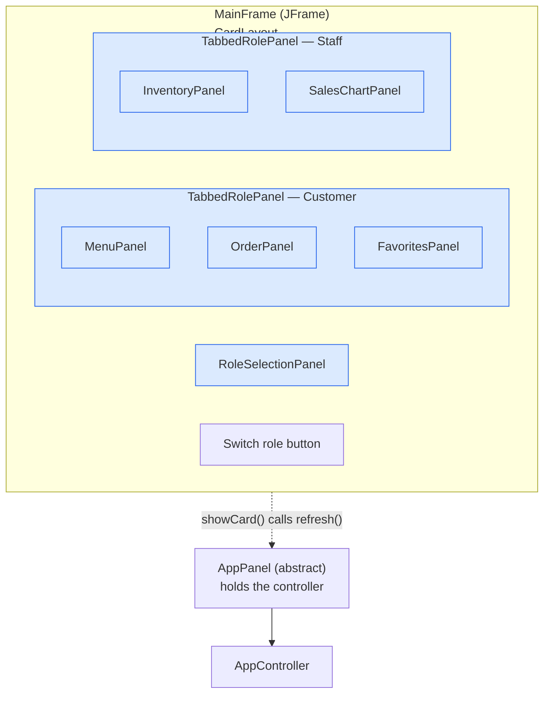

# Final Project for CS 5004 - (APPLICATION NAME/Update)

(remove this and add your sections/elements)
This readme should contain the following information:

* The group member's names and github accounts
* The application name and a brief description of the application
* Links to design documents and manuals
* Instructions on how to run the application

Ask yourself, if you started here in the readme, would you have what you need to work on this project and/or use the application?

### Order & Inventory (Model — Yixuan Liu)

`Order` is the customer's cart. It adds items and merges duplicates into one
line, adjusts quantities, removes items by name, and computes the running total
(price × quantity). Item order is preserved, and every getter returns a fresh
copy so callers cannot mutate the cart's internals.

`Inventory` tracks stock and sales in one class — there is no separate sales
record. It sets and reads stock per item, restocks and sells while never letting
stock go negative, and builds the low-stock sub-list from a staff-chosen
threshold (the required filtered-sub-list feature). On checkout it records a
sale: the order count and total revenue rise, and revenue is accumulated per
category (MAIN, DESSERT, BEVERAGE) for the staff sales chart.

Both classes are covered by JUnit 5 unit tests (38 tests), including edge cases:
non-positive quantities, over-selling, stock reaching exactly zero, unknown
items, empty orders, threshold boundaries, and defensive copies.

### GUI Components (View - L Boco)
The GUI is built from one window and a set of screens. Every screen is an `AppPanel`. `MainFrame` is the only class that is not a screen but a window.

The GUI (or View) is compromised of three parts, each with their own specific classes. The overarching component of
the GUI is the MainFrame(JFrame) where only one card is visible at a time. There is technical 4th part, AppPanel, since
it doesn't belong in any of the three as it acts more as a screen contract.

### View: AppPanel
`AppPanel` is an abstract that extends `Jpanel`. Every screen in the application is an `AppPanel`, including the
tabbed container. It holds the `AppController` reference each screen needs and declares the abstract `refresh()`.
It also supplies the shared `showEmptyState` and `showFailure` helpers so no subclass reimplements
them.

Additionally, `AppPanel` is not a screen and is never instantiated. It appears here rather than under any of the
three groups below because both *Windows & Navigation* and *Content Screens* are built on it, and `MainFrame`
switches screens through an `AppPanel` reference so the correct `refresh()` runs by dynamic dispatch.

#### *View: Windows & Navigation*
This component includes the panels that essentially are what the user sees regardless of the
chosen role.

`MainFrame` - Extends JFrame since the MainFrame, in actuality, is a window and not a screen since JFrame acts as the root of all the panel's containment tree.  In addition, MainFrame's superclass
can only be JFrame since it is the application's main window and requiring JFrame as the top-level container for application's Swing components.
By extending JFrame, MainFrame is able to place various panels within it. The MainFrame is responsible for the title bar, expected behaviors redraw/refresh and other closing behaviors, as well as the creation of the
visual's size. Navigation delegation rests onn the MainFrame as it decides which cards to show (or showing) since the only
switch button lives in this class.

`TabbedRolePanel` - Extends `AppPanel` and has a `JTabbedPane` (composition) that has other variations of AppPanel. Essentially, the containment tree for
tabbed panel would have Customer Panel and Staff Panel contained within. Refresh only redraws the current visible tab while keeping the other tabs as hidden.

`RoleSelectionPanel` - Extends `AppPanel` since this is a screen and not a window, and it is the first card
`MainFrame` shows on startup. The panel builds its heading and then walks `Role.values()` to build one button per
role, so a role added to the enum later shows up as a button here without this class being edited. The button text
itself is borrowed from `ItemTableFormat` so that a role and a category are formatted by the same rule. What this panel deliberately does not do is navigate. It has no idea which card belongs to which role and never
touches the `CardLayout`. It only announces the click through `RoleSelectionListener` and lets `MainFrame` decide
where that click leads. Its `refresh()` is empty on purpose since there is no model behind this screen, but the
method is still kept because `MainFrame` redraws every card it shows and this one cannot be the exception that
throws.

`RoleSelectionListener` - An interface rather than an abstract class since `MainFrame` is the class that has to
implement it, and `MainFrame` has already spent its single inheritance slot on `JFrame`. An abstract class here
would make the listener impossible to consume. It carries one method, `roleSelected(Role)`, which keeps `RoleSelectionPanel` ignorant of cards and keeps `MainFrame` in charge of navigation.

#### *View: Content Screens*
Consist mostly of classes that builds the widgets to create various pieces of the GUI.

`MenuPanel` - Extends `AppPanel` and is the customer's browse screen for the category filter, the keyword search,
and the two add buttons for cart and favorites. The category dropdown holds `String` labels instead of `Category`
constants, since "All categories" is not a real category and adding an `ALL` constant to the enum would crowd the
`Inventory`'s revenue bucketing for the sake of one dropdown.

The panel keeps a `displayedItems` list that is index-aligned with the table rows. The rows themselves carry only
display text, so a selected `MenuItem` is fetched by position rather than rebuilt by reading the cells back out.
Refresh replaces that list wholesale and never edits it in place.

`OrderPanel` - Extends `AppPanel` and shows the cart lines, the quantities, the running total, and checkout. It
declares its own four column headers rather than reusing the shared three, since a cart line needs Qty. and Subtotal
that a menu row does not have. Quantity is changed by the minus and plus buttons instead of an editable cell,
which keeps the table read-only and keeps every change flowing through the controller.

Its layout is broken into three tiers. Statics turn model values into display text and touch no widget, private
helpers read and write widgets, and handlers identify a target, call the controller, and then redraw.

`FavoritesPanel` - Extends `AppPanel` and covers view, remove, rename, save, and load for the favorites list.
Favorites deliberately have no path into the cart or checkout, so this screen owns no domain state, computes no
total, and writes no file itself. Since the persistence layer rethrows its `IOException` as an unchecked
`RuntimeException`, the compiler will not force this panel to catch anything, so the save and load calls are
wrapped in a try by convention and the message is shown in a `JOptionPane`.

`InventoryPanel` - Extends `AppPanel` and is the staff screen for the stock table, restocking, and exporting the
low stock sub-list. It shows two tables side by side, but only the full stock table allows a selection. The
sub-list table is display only, which is what stops the restock target from ever being ambiguous when the same
item appears twice on screen.

The applied threshold is kept in a field separate from whatever is currently typed in the threshold box, so the
list on screen always matches the number it was actually built from rather than the number someone is halfway
through typing. Export runs the chosen path through `ensureJsonExtension` first, since the required feature is a
JSON file and a missing extension should not be the thing that breaks it. It follows the same three tier layout
as `OrderPanel`.

`SalesChartPanel` - Extends `AppPanel` and draws the revenue by category bar chart with JFreeChart, plus the order
count and total revenue as text above it. Everything here is display only and nothing is exported. The
`DefaultCategoryDataset` behind the chart is updated in place on every redraw rather than rebuilt, so the chart
object and its container stay the same instance for the life of the screen.

This screen was built last on purpose. Revenue only accumulates at checkout, so there is nothing meaningful to
draw until `OrderPanel` works, and an empty state is shown until the first sale is recorded.

#### *View: Shared Structure*
The "Shared Structure" could have been part of the contents, but I decided to create it their own since this third
part works as the model to display text converter.

`ItemTableFormat` - A final class with a private constructor that throws, since this is a holder for static helpers
and there is no reason to ever instantiate it. It is not a screen and does not extend `AppPanel`. It owns the three
shared columns, Item, Category, and Price, so that `MenuPanel` and `FavoritesPanel` render the same thing without
either one keeping its own copy of the conversion.

`columnNames()` hands back a clone on every call so that a panel overwriting a header cannot reach into another
panel's headers. `formatEnumName` is general rather than category specific, which is why `RoleSelectionPanel` can
reuse it for its button labels. `clampSelection` decides which row survives a rebuild, since refresh replaces every
row and would otherwise wipe the user's selection on every redraw.

`ReadOnlyTableModel` - Extends `DefaultTableModel` and overrides `isCellEditable` to return false. This is a
top-level class rather than a nested one because four separate panels need it, and duplicating it inside each one
would mean four places to change if the rule ever changes.

This class is the structural version of the rule that the View does not touch the Model. Without it a user could
type a new price straight into a table cell and the display would disagree with the model with no controller call
in between. Making it impossible in the model is stronger than remembering not to do it.

#### *Tests for View*
The test classes fall into three groups. `MockController` and `MockFavoritesList` are the isolation
layer, a fake controller seeded with real `MenuItem` objects so that every screen can be built and
exercised without the Model or the real controller being finished, which is what let the View be
developed in parallel with the rest of the team. The `Mock*Demo` classes are not automated tests but
throwaway `main` methods that open one screen against that fake controller, since layout, spacing, and
whether a table actually looks right are things a JUnit assertion cannot check. The remaining `*Test`
classes target the package-private static helpers on each screen, the row builders, the header text,
and the selection clamping, so the test suite runs without opening a window and without a display
being available.

131 "automated" Junit Tests are spread to test different panels and their components:
`FavoritesPanelTest`
`InventoryPanelTest`
`ItemTableFormatTest`
`MainFrameTest`
`MenuPanelTest`
`OrderPanelTest`
`RoleSelectionPanelTest`
`SalesChartPanelTest`
`TabbedRolePanelTest`

