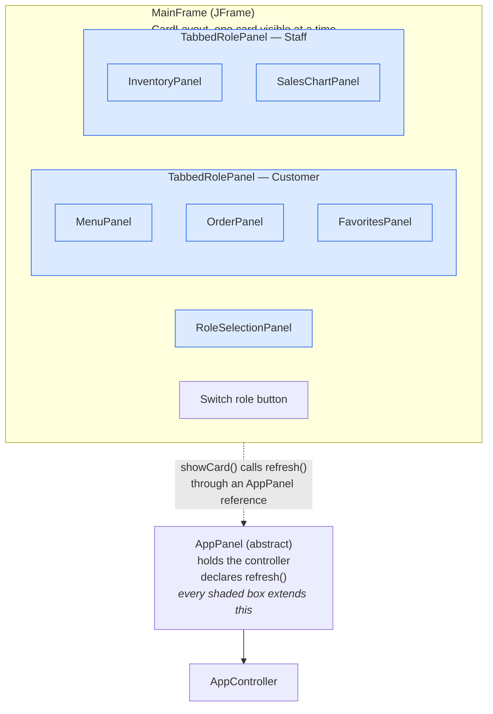

# Final Project for CS 5004 - (APPLICATION NAME/Update)

(remove this and add your sections/elements)
This readme should contain the following information: 

* The group member's names and github accounts
* The application name and a brief description of the application
* Links to design documents and manuals
* Instructions on how to run the application

Ask yourself, if you started here in the readme, would you have what you need to work on this project and/or use the application?

### Order & Inventory (Model — Yixuan Liu)

`Order` is the customer's cart. It adds items and merges duplicates into one
line, adjusts quantities, removes items by name, and computes the running total
(price × quantity). Item order is preserved, and every getter returns a fresh
copy so callers cannot mutate the cart's internals.

`Inventory` tracks stock and sales in one class — there is no separate sales
record. It sets and reads stock per item, restocks and sells while never letting
stock go negative, and builds the low-stock sub-list from a staff-chosen
threshold (the required filtered-sub-list feature). On checkout it records a
sale: the order count and total revenue rise, and revenue is accumulated per
category (MAIN, DESSERT, BEVERAGE) for the staff sales chart.

Both classes are covered by JUnit 5 unit tests (38 tests), including edge cases:
non-positive quantities, over-selling, stock reaching exactly zero, unknown
items, empty orders, threshold boundaries, and defensive copies.

### GUI Components (View - L Boco)

The GUI (or View) is compromised of three parts, each with their own specific classes. The overarching component of
the GUI is the MainFrame(JFrame) where only one card is visible at a time. There is technical 4th part, AppPanel, since
it doesn't belong in any of the three as it acts more as a screen contract. 

### View: AppPanel 
`AppPanel`

#### *View: Windows & Navigation* 
This component includes the panels that essentially are what the user sees regardless of the
chosen role.

`MainFrame` - Extends JFrame since the MainFrame, in actuality, is a window and not a screen since JFrame acts as the root of all the panel's containment tree.  In addition, MainFrame's superclass
can only be JFrame since it is the application's main window and requiring JFrame as the top-level container for application's Swing components. 
By extending JFrame, MainFrame is able to place various panels within it.  

The MainFrame is responsible for the title bar, expected behaviors redraw/refresh and other closing behaviors, as well as the creation of the 
visual's size. Navigation delegation rests onn the MainFrame as it decides which cards to show (or showing) since the only
switch button lives in this class. 

`TabbedRolePanel` - Extends `AppPanel` and has a `JTabbedPane` (composition) that has other variations of AppPanel. Essentially, the containment tree for 
tabbed panel would have Customer Panel and Staff Panel contained within. Refresh only redraws the current visible tab while keeping the other tabs as hidden. 

`RoleSelectionPanel`

`RoleSelectionListener`

#### *View: Content Screens*
Consist mostly of classes that builds the widgets to create various pieces of the GUI.

`MenuPanel`

`OrderPanel`

`FavoritesPanel`

`InventoryPanel`

`SalesChartPanel`

#### *View: Shared Structure*
The "Shared Structure" could have been part of the contents, but I decided to create it  their own since this third part
works as the model to display text converter.

`ItemTableFormat`

`ReadOnlyTableModel`

#### *Tests for View* 
`MockController`
`MockFavoritesList`
`MockFavoritesPanelDemo`
`MockMainFrameDemo`
`MockMenuPanelDemo`
`MockSharedControllerDemo`
`MockOrderPanelDemo`
`FavoritesPanelTest`
`ItemTableFormatTest`
`MainFrameTest`
`MenuPanelTest`
`RoleSelectionPanelTest`
`TabbedRolePanelTest`
`OrderPanelTest`
`InventoryPanelTest`
`SalesChartPanelTest`

